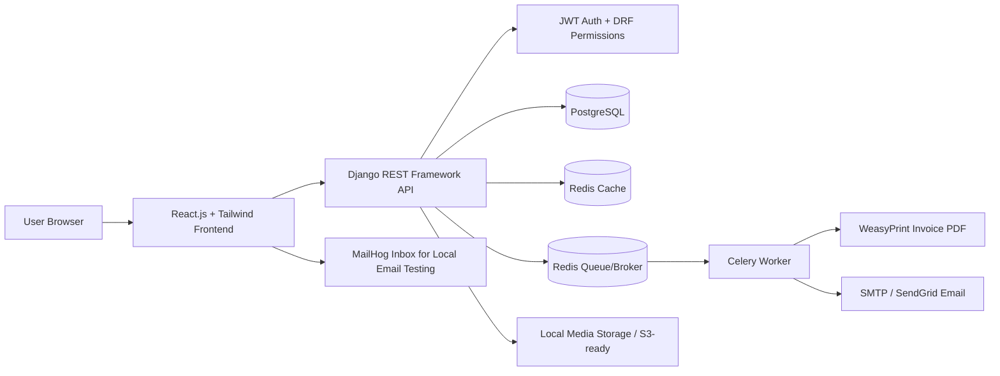
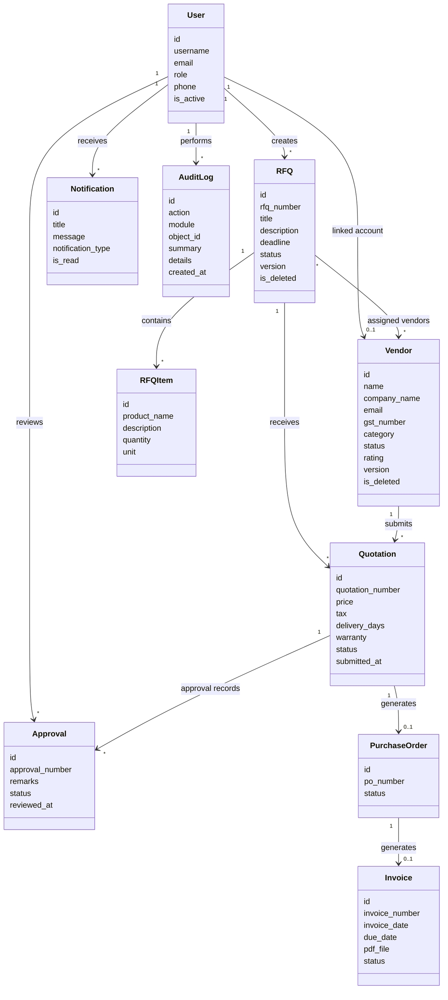
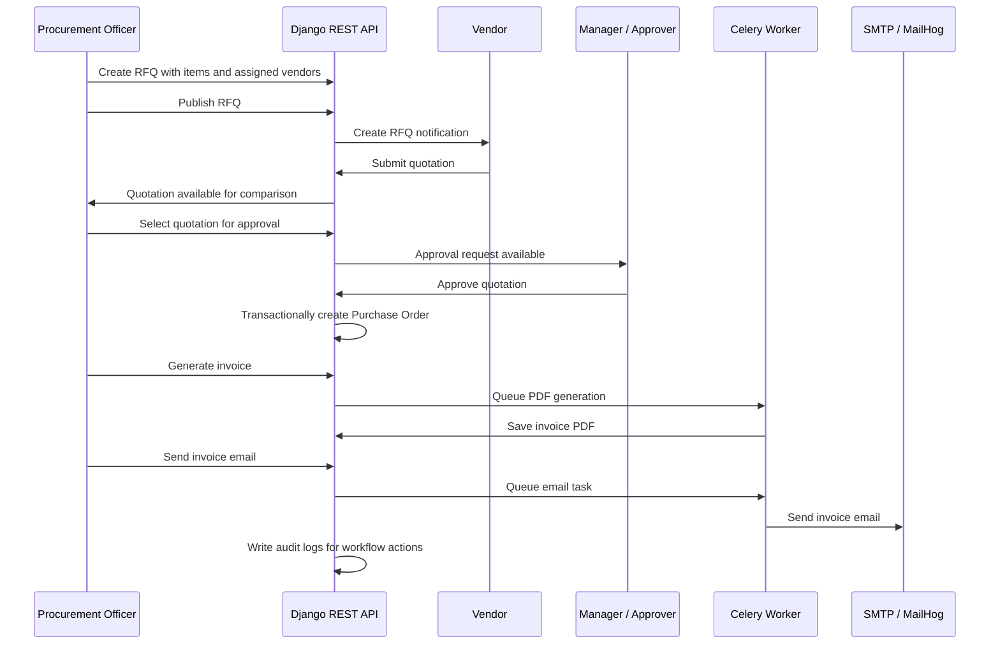
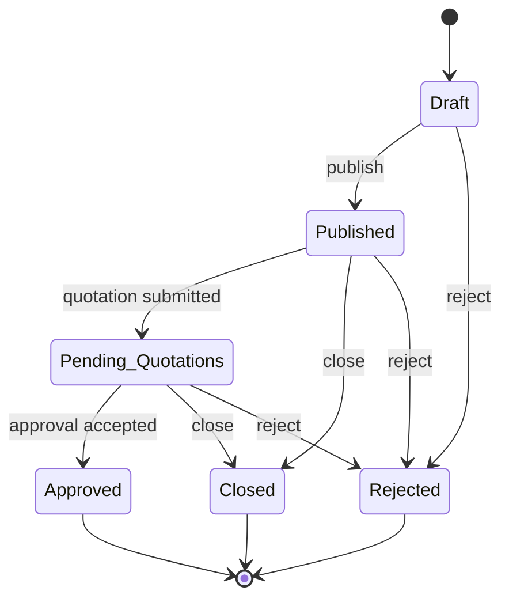
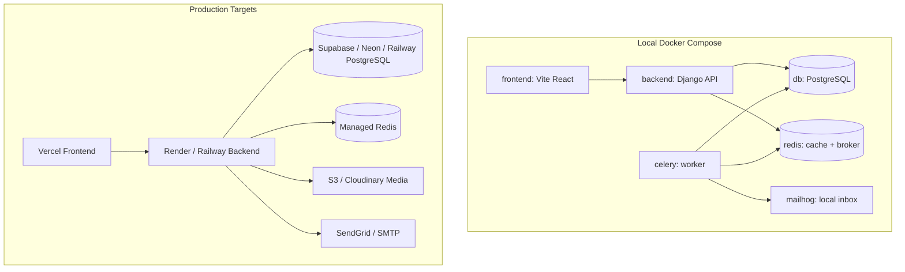

# AI Context: VendorBridge

## Project Summary

VendorBridge is a Procurement and Vendor Management ERP for digitizing procurement operations. The product centralizes vendor records, RFQs, vendor quotations, quotation comparison, approvals, purchase orders, invoice generation, invoice PDF/print/email flows, activity logs, notifications, reports, and analytics.

The primary goal is to reduce spreadsheet/email-driven procurement friction through structured workflows, role-based access, and real-time procurement tracking.

## Source Documents

- `docs/VendorBridge PRD.docx`
- `C:\Users\Jatin P\Downloads\VendorBridge PRD.docx`
- `C:\Users\Jatin P\Downloads\VendorBridge_System_Architecture.docx`
- `C:\Users\Jatin P\Downloads\Vendorbridge Hackathon Problem Statement.pdf`

## Product Scope

### In Scope

- User authentication and role-based access
- Vendor management
- RFQ creation and vendor assignment
- Vendor quotation submission and editing
- Quotation comparison by price, delivery time, tax, rating, and remarks
- Approval workflow with approve/reject actions and remarks
- Purchase order generation from approved quotations
- Invoice generation from purchase orders
- Invoice PDF download, printing, and email sending
- Notifications and activity logs
- Dashboard KPIs, reports, and procurement analytics

### Out of Scope for MVP

- Payment gateway integration
- Inventory management
- Accounting integration
- Mobile app
- AI-based vendor recommendations
- Multi-language support

## User Roles

### Admin

- Manage users and roles
- Manage vendors
- View procurement analytics
- View audit logs
- Perform system administration

### Procurement Officer

- Create RFQs
- Assign vendors to RFQs
- Compare vendor quotations
- Initiate approval workflows
- Generate purchase orders
- Generate invoices

### Vendor

- View assigned RFQs
- Submit and edit quotations
- Track RFQ status
- View related purchase orders

### Manager / Approver

- Review procurement requests
- Approve or reject quotations
- Add approval remarks
- Monitor procurement workflows

## Core Workflow

1. Procurement Officer creates an RFQ with items, quantity, deadline, attachments, and assigned vendors.
2. Vendors receive the RFQ invitation and submit quotations before the deadline.
3. Procurement team compares quotations side by side.
4. Selected quotation enters approval workflow.
5. Manager / Approver approves or rejects the request with remarks.
6. Approved quotation is converted into a purchase order.
7. Invoice is generated from the purchase order with tax and total calculations.
8. Invoice can be downloaded as PDF, printed, or emailed to the vendor.
9. Actions are captured in activity logs and surfaced through notifications and analytics.

## Recommended Modules

- Authentication and Users
- Dashboard
- Vendor Management
- RFQ Management
- RFQ Items
- Quotation Management
- Quotation Comparison
- Approval Workflow
- Purchase Orders
- Invoice Management
- Notifications
- Activity Logs
- Reports and Analytics

## Core Data Model

Expected entities:

- `User`: name, email, password hash, role, status
- `Vendor`: name, company, GST number, category, contact details, status, rating
- `RFQ`: RFQ number, title, description, deadline, status, created by
- `RFQItem`: RFQ reference, product/service name, quantity, unit, description
- `Quotation`: RFQ reference, vendor reference, price, tax, delivery days, status, notes, attachment
- `Approval`: quotation reference, approver, status, remarks, approved/rejected timestamp
- `PurchaseOrder`: PO number, quotation reference, vendor reference, total amount, status
- `Invoice`: invoice number, purchase order reference, tax, total, invoice date, due date, status
- `ActivityLog`: user, action, module, object id, timestamp
- `Notification`: user, title, message, type, read/unread state

Key relationships:

- One RFQ has many RFQ items.
- One RFQ is assigned to many vendors.
- One RFQ has many quotations.
- One vendor can submit many quotations.
- One approved quotation generates one purchase order.
- One purchase order generates one invoice.

## Important Status Values

RFQ statuses:

- Draft
- Published
- Pending Quotations
- Closed
- Approved
- Rejected

Approval states:

- Pending
- Under Review
- Approved
- Rejected
- Escalated

Invoice statuses:

- Draft
- Sent
- Paid
- Overdue

## Screens and UX Expectations

The UI should feel like a clean operational ERP, not a marketing site. Prioritize dense, scannable information, clear navigation, data tables, filters, status badges, modal forms, analytics cards, and quick actions.

Expected screens:

- Login / Signup / Forgot Password
- Dashboard / Home
- Vendor Management
- RFQ Creation and RFQ Detail
- Vendor Quotation Submission
- Quotation Comparison
- Approval Workflow
- Purchase Order Detail
- Invoice Generation / Preview
- Activity Logs and Notifications
- Reports and Analytics

## Security and Reliability Requirements

- Role-based authorization on every business module
- Secure password hashing
- JWT/session authentication depending on framework choice
- Token/session expiry
- Rate limiting for login, signup, password reset, and sensitive APIs
- CORS restricted to allowed frontend domains when applicable
- File upload validation by extension, MIME type, and size
- Input validation for all forms and APIs
- Protection against SQL injection and XSS
- Audit logs for RFQ creation, quotation submission, approvals, PO generation, invoice generation, and email actions
- Environment variables for secrets, database URL, email credentials, and cloud credentials

## Performance and Analytics

Targets and expectations:

- Page load below 3 seconds for normal dashboard and list views
- Optimized database queries and indexed lookup fields
- Dashboard metrics for total vendors, active RFQs, pending approvals, total procurement value, and monthly procurement trends
- Reports for vendor performance, procurement summary, invoices, purchase orders, and approval workflow
- Exportable reports where feasible

## Architecture Reference

The source architecture recommends:

- Frontend: React.js with Tailwind CSS
- Backend: Django with Django REST Framework
- Database: PostgreSQL
- Authentication: JWT with DRF permissions
- Cache / queue: Redis
- Background jobs: Celery
- PDF generation: WeasyPrint or ReportLab
- Email: SMTP or SendGrid
- Containerization: Docker and Docker Compose
- Deployment: Vercel for frontend, Render/Railway/Fly.io for backend, managed PostgreSQL, managed Redis

## UML Diagrams

### System Component Diagram

### Domain Class Diagram

### Procurement Sequence Diagram

### RFQ State Diagram

### Deployment Diagram

## Implementation Notes

This project should use the requested full-stack architecture:

- `backend/`: Django + Django REST Framework API
- `frontend/`: React.js + Tailwind CSS app
- `docker-compose.yml`: PostgreSQL, Redis, backend, Celery worker, and frontend services
- `postman/`: Postman collection for API testing

Use Django models and DRF viewsets for the procurement domain. JWT authentication, DRF permissions, role checks, throttling, and audit logs are required for the backend. Celery and Redis should handle invoice PDF generation and email sending. The frontend should call backend APIs through a shared Axios client and keep the UI operational, dense, and ERP-focused.

## MVP Priorities

Build in this order:

1. User roles, permissions, and core models
2. Vendor management
3. RFQ creation with RFQ items and vendor assignment
4. Vendor quotation submission
5. Quotation comparison
6. Approval workflow
7. Purchase order generation
8. Invoice generation and PDF report
9. Notifications/activity logs
10. Dashboard and reports

## Acceptance Criteria

- Each role sees only the actions and data relevant to that role.
- Procurement Officer can create an RFQ and assign vendors.
- Vendor can submit a quotation for an assigned RFQ.
- Procurement team can compare quotations for an RFQ.
- Manager / Approver can approve or reject with remarks.
- Approved quotation can generate a purchase order.
- Purchase order can generate an invoice.
- Invoice can be rendered as PDF and prepared for print/email.
- Important workflow actions are logged.
- Dashboard and reports expose procurement status and trends.
