# VendorBridge

### Enterprise Procurement & Vendor Management ERP

VendorBridge is a modern procurement lifecycle management platform designed to streamline vendor onboarding, RFQ management, quotation comparison, approval workflows, purchase order generation, invoice processing, and procurement analytics.

Built for the Odoo x KSV Hackathon 2026 by Team Minus.

---

## Overview

VendorBridge centralizes the complete procurement lifecycle into a single platform, eliminating fragmented communication, manual spreadsheets, and inefficient approval chains.

The system enables organizations to:

- Manage Vendors
- Create RFQs
- Receive Vendor Quotations
- Compare Vendor Offers
- Execute Approval Workflows
- Generate Purchase Orders
- Generate Invoices
- Track Procurement Activities
- Monitor procurement analytics

The platform eliminates manual procurement processes and centralizes vendor interactions into a single system.

---

## Problem Statement

Traditional procurement processes often involve:

- Manual quotation collection
- Spreadsheet-based comparisons
- Lack of approval tracking
- Poor vendor visibility
- Inefficient purchase order generation
- Scattered procurement records

VendorBridge addresses these challenges through a centralized workflow-driven ERP solution.

---

## Key Features

### Vendor Management

- Vendor Registration
- Vendor Profile Management
- Status Tracking
- Contact Management
- Vendor categorization

### RFQ Management

- Create RFQs
- Assign Vendors
- Set procurement Deadlines
- Track RFQ Status
- Manage procurement requests

### Quotation Management

- Vendor Quotation Submission
- Quotation History
- Comparative Analysis

### Approval Workflow

- Manager Approval
- Rejection Handling
- Workflow Tracking

### Purchase Order Management

- Auto-generated Purchase Orders
- PO Tracking
- Procurement records

### Invoice Management

- Invoice Generation
- Downloadable Invoices

### Analytics Dashboard

- Procurement Metrics
- Vendor Statistics
- Approval Insights

### Audit Logs

- User activity tracking
- Workflow history
- Security audit trail

---

## System Architecture
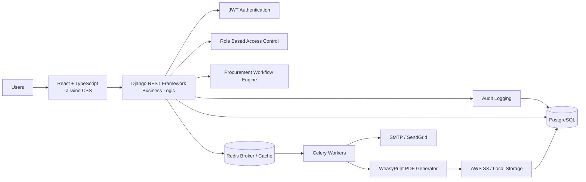
##### This architecture follows a modern service-oriented approach using React for the frontend, Django REST Framework for APIs, PostgreSQL for persistence, Redis for queueing, Celery for background processing, and Docker for deployment consistency.
---

## Procurement Workflow

```mermaid
flowchart LR

RFQ[Create RFQ]

ASSIGN[Assign Vendors]

QUOTE[Vendor Submits Quotation]

COMPARE[Compare Quotations]

SELECT[Select Vendor]

APPROVE[Manager Approval]

PO[Generate Purchase Order]

INVOICE[Generate Invoice]

PDF[Export PDF]

LOGS[Audit Logs]

RFQ --> ASSIGN

ASSIGN --> QUOTE

QUOTE --> COMPARE

COMPARE --> SELECT

SELECT --> APPROVE

APPROVE --> PO

PO --> INVOICE

INVOICE --> PDF

PDF --> LOGS
```
This workflow represents the complete procurement lifecycle:

#### RFQ → Vendor Quotation → Comparison → Approval → Purchase Order → Invoice → Audit Logs
---

## User Roles

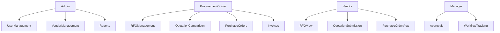

The application implements strict role-based access control using JWT authentication and Django REST Framework permissions.
### Admin

- Manage Users
- Manage Vendors
- Access Reports

### Procurement Officer

- Create RFQs
- Compare Quotations
- Generate Purchase Orders
- Generate Invoices

### Vendor

- View RFQs
- Submit Quotations
- Track Purchase Orders

### Manager

- Review Quotations
- Approve Requests
- Reject Requests

---
## Authentication & Security

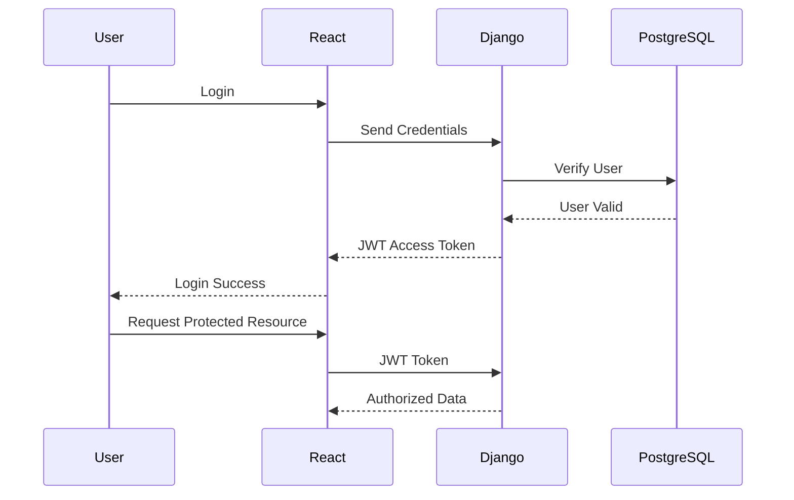

### Authentication
- JWT Authentication
- Secure Access Tokens
- Refresh Tokens
### Authorization
- Role-Based Access Control (RBAC)
- DRF Permission Classes
### Security Features
- API Rate Limiting
- Secure Password Storage
- Request Validation
- Protected Endpoints
- Audit Logging
---

## Technology Stack

### Frontend

- React
- Tailwind CSS

### Backend

- Django
- Django REST Framework

### Database

- PostgreSQL

### DevOps

- Docker
- Docker Compose

### Version Control

- Git
- GitHub

### Authentication
- JWT
### Security
- Role-Based Access Control
- DRF Permissions
- Rate Limiting
- Audit Logs

### Background Processing
- Celery
### Queue & Cache
- Redis
### PDF Generation
- WeasyPrint
### Email Services
- SMTP
- SendGrid Compatible


### Containerization
- Docker
- Docker Compose

### API Testing
- Postman Collection

---

## Folder Structure

vendorbridge/

├── frontend/

│ ├── src/

│ ├── components/

│ ├── pages/

│ └── services/

│

├── backend/

│ ├── apps/

│ ├── api/

│ ├── models/

│ └── serializers/

│

├── docker/

├── docs/

├── docker-compose.yml

└── README.md

---

## Installation

### Clone Repository

```bash
git clone <repository-url>
cd vendorbridge
```

### Start Containers

```bash
docker-compose up --build
```

### Frontend

```bash
npm install
npm run dev
```

### Backend

```bash
python manage.py migrate
python manage.py runserver
```

---

## Screenshots

### Admin Page

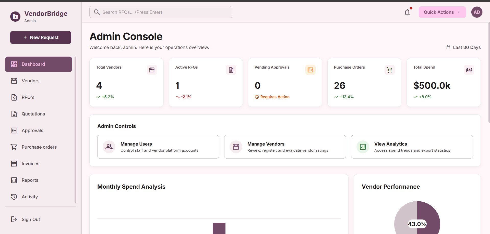

### Procurement Page

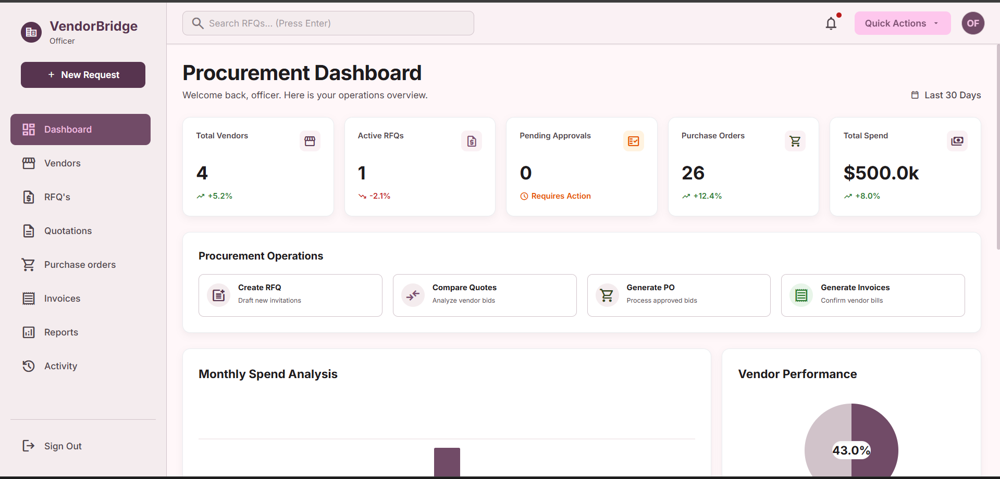

### Vendors Page

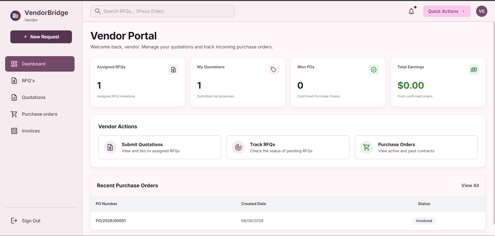

### Approval Page

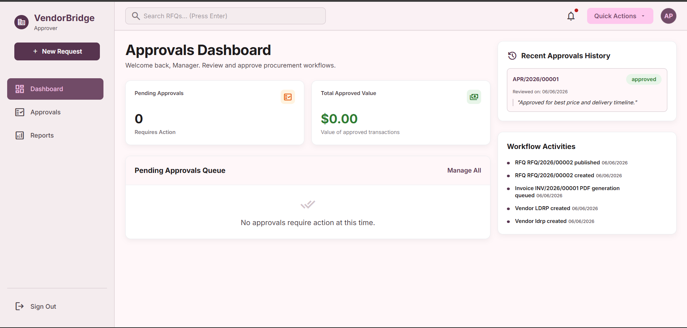

### Approval Workflow

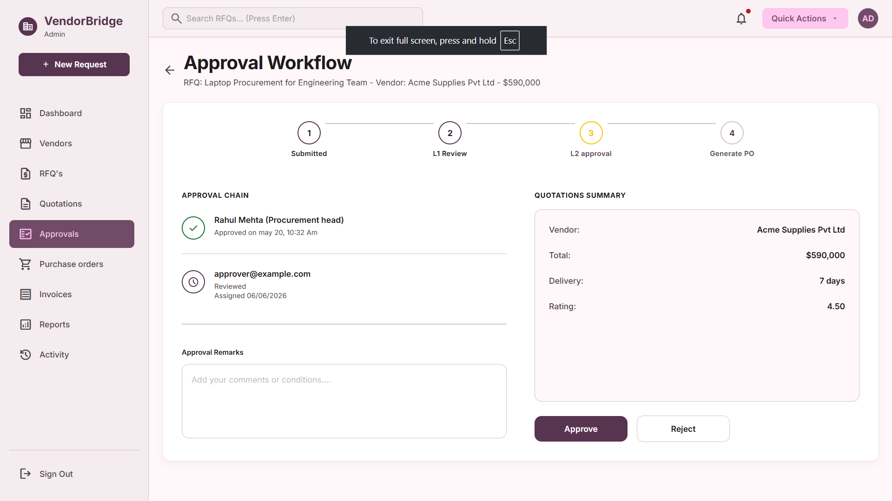

### Request for Quotations


---
## Database Design

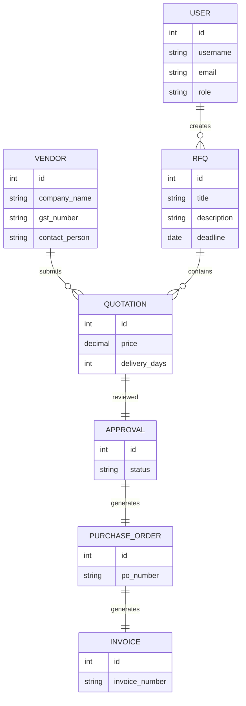

---

## Workflow States

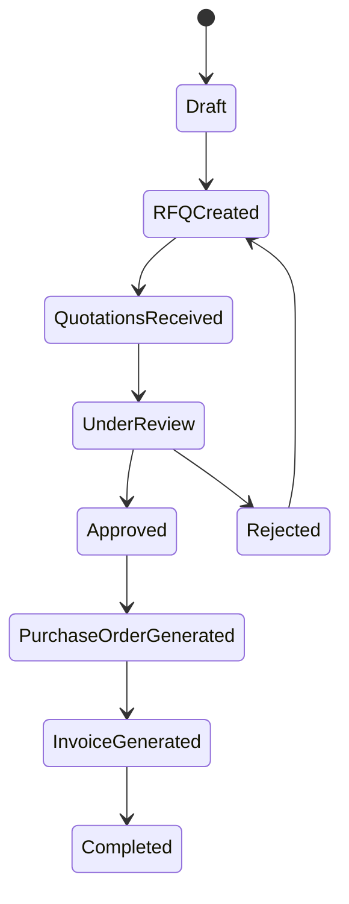


---

## Team Members

- Nirmit Rathod
- Ayan Shaikh
- Jatin Panchal
- Bhavarth Dobariya

---

## Built For

Odoo x KSV Hackathon 2026

Designed to demonstrate enterprise procurement workflow automation using modern full-stack technologies.